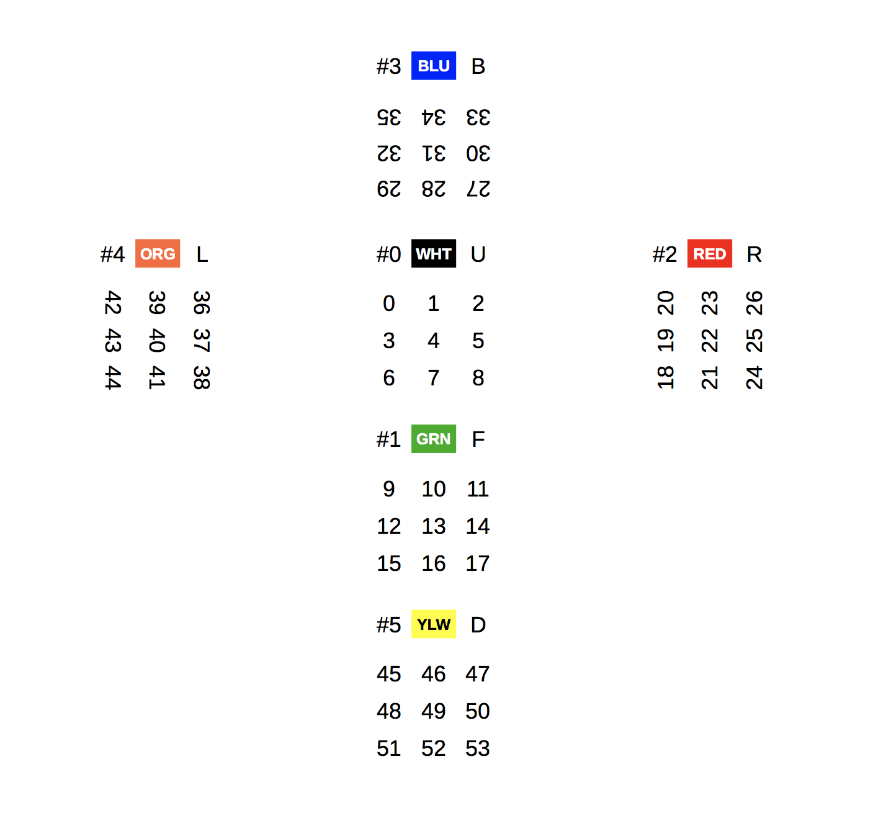

# Rubik's Cube in go-lang

Thoroughly-tested representation of the Rubik's Cube in `go-lang`. A naive and limited BFS solver is provided.

## The Cube

The cube is represented as a `[]rune`:



Cube faces are numbered from #0 (white, upward) to #5 (yellow, downward). By convention, the face color is the color of the square in its center, the one that never moves. You are free to disregard the proposed color, position and numbering scheme in this picture so long that you manipulate valid cubes.

You can instantiate a new solved cube, or with the initial state of your choice.

```
cube := rubik.NewSolvedCube()
scrambled := rubik.NewCube("bwwbwwyyr orwogbygb gbbrrwrrw ooygbygbr oogoogyyb rrwgywgyo")
```

Then move the faces. For instance, front face clockwise, upper face clockwise, right face clockwise,
and finally upper face counter clockwise:

```
moved := cube.F().U().R().Uc()
```

The cube is **immutable**, so each manipulation returns a new cube.

## Solver

A naive solver that uses BFS is available. But because the resolution space is very large,
the solver will only work on slightly scrambled cubes (3-4 moves away from a solved cube),
even though cycles are detected and eliminated.

Beyond that, it will only consume time and fail with insufficient memory.

```
solved := rubik.Solve(cube)
```

See [better algorithms](https://en.wikipedia.org/wiki/Optimal_solutions_for_Rubik%27s_Cube) or
[Algorithms for solving the Rubik's cube - Harpreet Kaur](HarpreetKaur.pdf)
by Harpreet Kaur.
